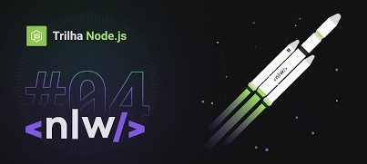

<p align="center">

<h1 align="center">API REST para NPS</h1>
</p>

<p align="center">


</p>

---
<p align="center">
  <a href="#-information_source-sobre">Sobre</a> •
  <a href="#-desktop-computer-documentação">Documentação</a> • 
  <a href="#-gear-teccnologias-utilizadas">Tecnologias</a> • 
  <a href="#-woman_office_worker-autora">Autora</a> • 
  <a href="#-pencil-licença">Licença</a>
</p>
<br>

# ℹ️ Sobre

Projeto desenvolvido na trilha NodeJs da Next Level Week 4 oferecida pela [Rocketseat]() e ministrado pela [Daniele Leão](https://www.instagram.com/dani_leao/).

O projeto consiste em uma API de NPS (Net Promoter Score), com sistema de cadastramento de usuários, cadastramento de pesquisas de satisfação, envio de pesquisa por email e cálculo do NPS.

<br><br>

# 🖥️ Desenvolvimento

- Instale o [Yarn](https://yarnpkg.com/)
- Instale o [NodeJs](https://nodejs.org/en/)
- Clone este repositório
  ```bash
  git clone https://github.com/nlnadialigia/api-nlw-nodejs.git
  ```
- Acesse a pasta do projeto
  ```bash
  cd api-nlw-nodejs
  ```
- Instale todas às dependências
  ```bash
  yarn
  ```
- Rodar as migrations
  ```bash
  yarn typeorm migration:run
  ```
- Rodar a API
  ```bash
  yarn dev
  ```

⚡ Todo projeto foi documentado com o [Swagger](https://swagger.io). Para conferir os endpoints, com a API rodando, [acesse aqui](http://localhost:3090/doc).

⚡ Quando do envio de email pelo endpoint SendMail é criado um link, que aparecerá no terminal. Clique nele e verá o email enviado. 

<br>
<p align="center">
  
</p>


<br>

# ⚙️ Tecnologias utilizadas

<table border="1" align="center" width="450">
  <tr>
    <td><a href="https://eslint.org">Eslint</a></td>
    <td><a href="https://jestjs.io">Jest</a></td>
    <td><a href="https://typeorm.io">Typeorm</a></td>
  </tr>
  <tr>
    <td><a href="https://expressjs.com/pt-br">Express</a></td>
    <td><a href="https://github.com/okonet/lint-staged">Lint-staged</a></td>
    <td><a href="https://www.npmjs.com/package/ts-jest">Ts-jest</a></td>
  </tr>
  <tr>
    <td><a href="https://www.npmjs.com/package/express-async-errors">Express-async-errors</a></td>
    <td><a href="https://nodemailer.com">Nodemailer</a></td>
    <td><a href="https://www.npmjs.com/package/ts-node-dev">Ts-node-dev</a></td>
  </tr>
  <tr>
    <td><a href="https://www.npmjs.com/package/git-commit-msg-linter">Git-commit-msg-linter</a></td>
    <td><a href="https://www.npmjs.com/package/reflect-metadata">Reflect-metadata</a></td>
    <td><a href="https://www.typescriptlang.org">Typescript</a></td>
  </tr>
  <tr>
    <td><a href="https://handlebarsjs.com">Handlebars</a></td>
    <td><a href="https://www.npmjs.com/package/sqlite3">Sqlite3</a></td>
    <td><a href="https://www.npmjs.com/package/uuid">Uuid</a></td>
  </tr>
  <tr>
    <td><a href="https://www.npmjs.com/package/husky">Husky</a></td>
    <td><a href="https://www.npmjs.com/package/supertest">Supertest</a></td>
    <td><a href="https://github.com/jquense/yup">yup</a></td>
  </tr>

</table>

<br>

# 👩‍💼 Autora

<p><b>Nádia Ligia</b></p>

[](https://www.linkedin.com/in/nlnadialigia/) 
[](mailto:nlnadialigia@gmail.com)<br>


<br>

# 📝 Licença

Esse projeto está sob a licença MIT. Veja o arquivo [LICENSE](../../LICENSE) para mais detalhes.


